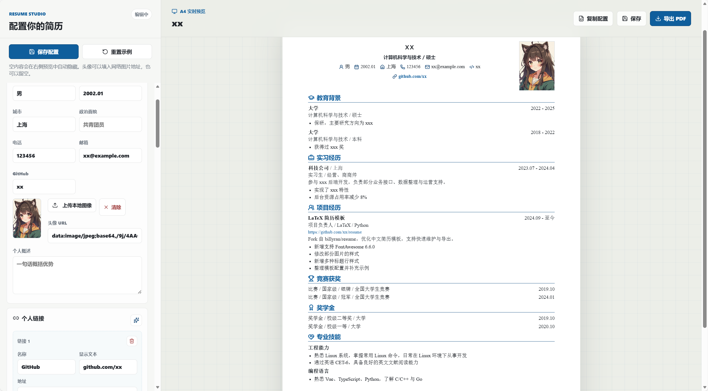

# Vue Resume Builder

一个本地使用的简历编辑器。基于 Vue 3 + Vite，左侧填写内容，右侧实时预览 A4 简历，最后导出 PDF。

不需要 LaTeX 环境，也不需要改模板语法；内容主要通过页面表单或 `src/data/resume.ts` 配置。



## 特点

- 本地运行，数据默认保存在浏览器本地
- 配置简单，默认内容集中在 `src/data/resume.ts`
- 空模块自动隐藏，例如没有工作经历就不会显示对应标题
- 支持本地上传头像，也支持头像 URL
- 实时 A4 预览，一键导出 PDF
- 可添加教育、实习、工作、项目、获奖、技能和自定义模块

## 开始使用

```bash
npm install
npm run dev
```

打开终端提示的地址，通常是：

```text
http://127.0.0.1:5173
```

构建：

```bash
npm run build
```

## 修改默认内容

默认简历数据在：

```text
src/data/resume.ts
```

页面里点击“重置示例”时，会恢复这里的默认配置。

如果某个模块不需要，保持数组为空即可：

```ts
work: []
```

这样预览里不会渲染“工作经历”。

## 导出

点击页面右上角“导出 PDF”即可。

如果图片来自网络 URL，建议使用允许跨域访问的图片地址；本地上传头像通常更稳定。

